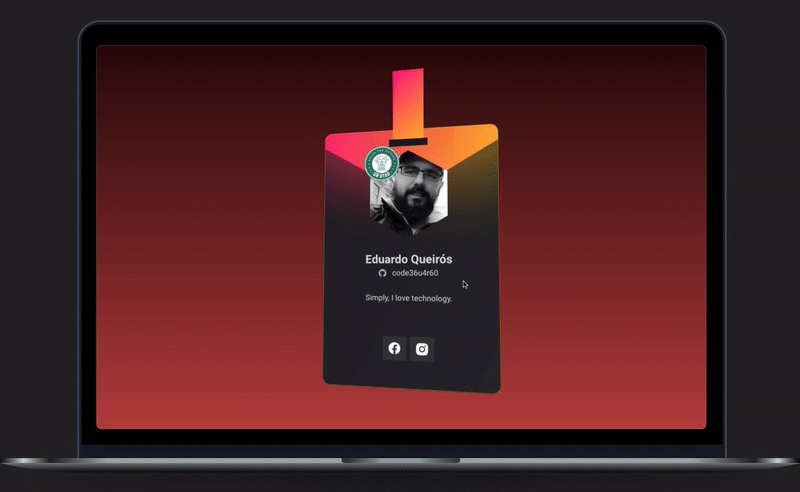

<h1 align="center">Badge</h1>

  <a href="#-tecnologias">Tecnologias</a>&nbsp;&nbsp;&nbsp;|&nbsp;&nbsp;&nbsp;
  <a href="#-projeto">Projeto</a>&nbsp;&nbsp;&nbsp;|&nbsp;&nbsp;&nbsp;
  <a href="#-layout">Layout</a>&nbsp;&nbsp;&nbsp;|&nbsp;&nbsp;&nbsp;
  <a href="#memo-licença">Licença</a>

  

 

## 🚀 Tecnologias

Esse projeto foi desenvolvido com as seguintes tecnologias:

- HTML
- CSS
- JavaScript

## 💻 Projeto

Este projeto foi realizado como desafio durante um evento da [Rocketseat](https://www.rocketseat.com.br/)

O dev.finances é uma aplicação de controle financeiro, onde é possível cadastrar e excluir transações e ver o saldo de entrada e saída 💰

## 🔖 Layout

Layout do projeto: [aqui](https://www.figma.com/file/qvG4lalqRUDPxS5I3KkMTU/%5BNLW-Heat---Mission%3A-Origin%5D-DoWhile2021-(Community)?node-id=0%3A1). 
É necessário ter conta no [Figma](https://figma.com).

## :memo: Licença

Esse projeto está sob a licença MIT. Veja o arquivo [LICENSE](LICENSE.md) para mais detalhes.

---

Feito com ♥ by Eduardo Queirós @Code36u4r60 :wave:
